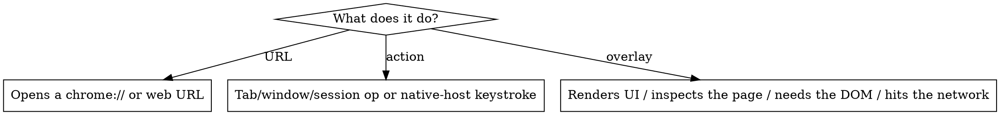

# Adding a SuperChrome Palette Command

## Overview

Every `>` command needs **three things registered**, plus **one behavior wired** in one of three places depending on what it does. Pick the command type first — that decides everything else.

## Step 1 — Pick the command type



| Type | Behavior lives in | Example |
|------|-------------------|---------|
| **URL** | `PAGE_COMMANDS` map in `src/features/commands/index.ts` | `open-settings` |
| **Action** | a `case` in `runCommand()` in `src/features/commands/index.ts` (runs in background worker) | `duplicate-tab` |
| **Overlay** | a branch in `executeItem()` in `src/palette.ts` calling an `enterX()` you write | `page-info`, `speed-test` |

## Step 2 — Register (ALL command types, always)

In `src/features/commands/index.ts`:

```ts
// 1. add to PALETTE_COMMANDS (controls search + ordering)
{ id: 'my-command', label: 'My Command' },

// 2. add to COMMAND_META (icon + tile color; '' color = no tile)
'my-command': { icon: 'gauge', color: '#3ab5c6' },
```

The `icon` must resolve in `ALL_ICONS` (`src/ui/shared/icons.ts`) — reuse an existing key or add it there first. Keep the entry next to related commands: `PALETTE_COMMANDS` is display/priority-ordered, so group siblings (e.g. put a new `page-*` overlay by the others).

## Step 3 — Wire the behavior

**URL:** just add `'my-command': 'chrome://…'` to `PAGE_COMMANDS`. Done — `runCommand` opens it.

**Action:** add a `case 'my-command':` in `runCommand()`. Tab-scoped ops must act on the passed `srcTabId` (fall back to `senderTab(sender)`), never the palette page. Native-host keystrokes/menus go through `chrome.runtime.sendNativeMessage('com.superchrome.host', …)`.

**Overlay:** add a branch in `executeItem()` (`src/palette.ts`):
```ts
} else if (item.commandId === 'my-command') {
  enterMyCommand()
  return
```
Write `enterMyCommand()` near the other `enterX()` functions. Render via `enterPageList(label, items, noun, header?)`:
- `items` are `RemoteItem[]`. For copyable info rows use `kind: 'calc'` — Enter copies the row's `.text`, and `typeText: 'Copy'` shows the affordance (see `enterPageInfo`). Link rows use `kind: 'search'` with a `url`.
- `header` is an **optional** DOM node above the list. Omit it for a static snapshot (the plain `enterPageList` list is enough — see `enterPageInfo`, `enterTrackers`). Pass one only for custom/live UI (see `enterQr`, `enterSpeedTest`).

A synchronous DOM-only overlay (no network) is the simplest kind — model it on `page-info` / `page-trackers`, not Speed Test. The CSP/background gotcha below applies **only to `fetch`**; reading the DOM (`innerText`, `querySelectorAll`) in the content script is always fine.

## Gotchas (the non-obvious parts)

- **Network requests run in the background worker, not the content script.** The host page's CSP blocks content-script `fetch` on strict sites (GitHub, etc.). Do the fetch in `background.ts` and stream results to the overlay over a `chrome.runtime.connect({ name })` Port; abort in-flight work on `port.onDisconnect`. See the `'speedtest'` port + `runSpeedTest`.
- **Extract logic into a testable module.** Non-trivial logic goes in `src/features/<name>/index.ts` (or `src/features/page/<name>.ts` for page tools) as **pure functions** with a `*.test.ts` (vitest). Inject impure dependencies so they're fakeable — `fetchImpl`/`now` for network features (`src/features/speedtest/`), or just take the extracted values as arguments for DOM tools (leave the DOM traversal in the palette, pass the result to the pure function — see `src/features/page/trackers.ts`).
- **Register teardown only if the command allocates a resource** — a Port, an event listener, or overlay DOM elements. Add a `teardownMyCommand()` call inside `closePalette()`, next to `teardownFind()` / `teardownSpeedTest()`. A plain `enterPageList` overlay allocates nothing (`closePalette` already resets list state), so it needs **no** teardown.
- **Live rows:** keep a reference to a `RemoteItem` you put in the list, mutate its `.text`/`.detail`, then call `updateList()` to repaint. Mutating the `header` node's children repaints for free.

## Step 4 — Verify (required before commit)

```sh
npm run typecheck && npm test && npm run build
```

All three must pass. Add a unit test for any new logic module.

## Worked examples

**Simple DOM overlay:** `enterPageInfo` / `enterTrackers` in `src/palette.ts` (+ `src/features/page/trackers.ts` for the pure part). Start here for a page tool that doesn't touch the network.

**Overlay + network (the heavy template):** `Speed Test`. Read these five diffs together:
- `src/features/speedtest/index.ts` + `index.test.ts` — pure engine, injected fetch/clock
- `src/background.ts` — `onConnect('speedtest')` port runner with `AbortController`
- `src/palette.ts` — `enterSpeedTest()` (live header) + `teardownSpeedTest()` + `executeItem` branch
- `src/features/commands/index.ts` — the `PALETTE_COMMANDS` + `COMMAND_META` entries
